# 02 - Information Architecture & Sitemap

> Comprehensive structural blueprint for the modernized **Dalal Machine Tools Agency Pvt. Ltd.** website, mapping legacy content to a high-converting industrial architecture inspired by the ThemeForest Machinery template.

---

## 🗺 1. Complete Website Sitemap Hierarchy

```mermaid
graph TD
    Root[Dalal Machines Portal] --> Home[Home / Overview]
    Root --> About[About Company & Global Sourcing]
    Root --> Used[Used Machinery Catalog]
    Root --> BrandNew[Brand New Machinery]
    Root --> Services[Core Services & Import Solutions]
    Root --> Gallery[Gallery & Live Under-Power Videos]
    Root --> Contact[Contact & RFQ Center]

    Used --> Forming[Metal Forming Machinery]
    Used --> Cutting[Metal Cutting Machinery]

    Forming --> F1[Hot Forging Presses]
    Forming --> F2[Knuckle Joint Presses]
    Forming --> F3[Pneumatic & Drop Hammers]
    Forming --> F4[Friction Screw Presses]
    Forming --> F5[Mechanical & Hydraulic Presses]
    Forming --> F6[Cold Forging & Upsetter Machines]
    Forming --> F7[Open Die Presses & Manipulators]

    Cutting --> C1[Horizontal Boring Machines - e.g. TOS W9A]
    Cutting --> C2[Vertical Machining Centres - VMC]
    Cutting --> C3[Horizontal Machining Centres - HMC]
    Cutting --> C4[Vertical Turning Lathes - VTL]
    Cutting --> C5[Gear Hobbing & Shaping Machines]
    Cutting --> C6[Heavy Duty CNC Lathes]

    Services --> S1[European & Russian Stock Sourcing]
    Services --> S2[On-Site Power Inspection Abroad]
    Services --> S3[High Seas Sales in INR with GST Benefits]
    Services --> S4[CIF Shipping up to 6300 Ton Capacity]
    Services --> S5[Port Customs Clearance at Nhava Sheva / Mumbai]
    Services --> S6[Doorstep Heavy Haulage Logistics]
```

---

## 🔗 2. URL Routing & Legacy Migration Map

All URLs are structured with clean, SEO-optimized slugs. A 301 redirection table is prepared below to ensure zero loss of existing search rankings from the legacy `dalalmachines.com` domain.

| Legacy URL | Modern Clean Route | Page Purpose & Template |
|---|---|---|
| `/` | `/` | **Homepage**: High-impact hero slider, core stats, categorized inventory preview, services grid, RFQ form. |
| `/metal-forming-machinery` | `/used-machines/metal-forming` | **Forming Catalog**: Filterable grid with sub-categories (Forging Presses, Hammers, Shears). |
| `/metal-cutting-machinery` | `/used-machines/metal-cutting` | **Cutting Catalog**: Filterable grid with sub-categories (Boring, VMC, HMC, Lathes). |
| `/brand-new-machines` | `/brand-new-machinery` | **New Machinery Showcase**: Modern new equipment specifications, distributor partnerships. |
| `/pages/gallery/index` | `/gallery` | **Media Gallery**: High-res workshop photos and YouTube/HTML5 video embeds of machines under power. |
| `/pages/contact/index` | `/contact` | **Contact & Inquiry Page**: Interactive Google map, Mumbai office card, emergency WhatsApp CTA, RFQ form. |
| `/pages/usedmachine/view/54` | `/used-machines/[category]/[slug]` | **Machine Detail View**: Complete technical specifications, foundation drawings, inspection report, inquiry button. |
| *(New)* | `/about-us` | **Company Heritage**: 20+ years track record, European sourcing network, leadership. |
| *(New)* | `/services` | **Import & Inspection Services**: High Seas Sales explained, customs clearance, CIF shipping. |
| *(New)* | `/request-a-quote` | **Multi-Step RFQ Modal / Dedicated Page**: Instant quote request with capacity/tonnage selector. |

---

## 🧭 3. Navigation Structure & Menus

### A. Top Information Bar (Utility Header)
- **Left**: 
  - 📍 Mumbai Head Office: `C-10, 3rd Floor, Commerce Centre, 78, Tardeo Main Road, Mumbai - 400034`
  - 🕒 Mon - Sat: 9:30 AM - 6:30 PM IST
- **Right**:
  - ✉️ `dalalmachine@gmail.com`
  - 📞 `+91-22-67439873` / `+91 9821232131`
  - 🟢 WhatsApp Quick Connect Button

### B. Main Navigation Bar (Sticky Desktop & Mobile Drawer)
1. **Home**
2. **About Us**
   - Company Profile (20+ Years Legacy)
   - European & Russian Sourcing Network
   - Quality Guarantee & On-Site Inspection
3. **Used Machinery** *(Mega Menu)*
   - **Column 1: Metal Forming Machinery (16 Types)**
     - Hot Forging Presses (500T to 6,300T)
     - Knuckle Joint Presses
     - Mechanical Sheet Metal Presses
     - Hydraulic Sheet Metal Presses
     - Pneumatic & Counterblow Hammers
     - Friction Screw Presses
     - Cold Forging Presses
     - Forging Rolls & Upsetters
     - Open Die Forging Presses & Manipulators
   - **Column 2: Metal Cutting Machinery (10 Types)**
     - Horizontal Boring Machines (TOS, Skoda, Pama)
     - Vertical Machining Centres (VMC)
     - Horizontal Machining Centres (HMC)
     - Vertical Turning Lathes (VTL)
     - Gear Hobbing & Shaping Machines
     - Heavy Duty CNC Lathes
     - Milling & Slotting Machines
   - **Column 3: Featured Stock / Ready in Europe**
     - Image card with live stock in Europe / Russia
     - "Download Ready Stock Catalog (PDF)"
4. **Brand New Machinery**
5. **Services & Solutions**
   - On-Site Inspection Under Power
   - High Seas Sales (Save Customs Overhead & Pay in INR)
   - CIF Shipping (Up to 6,300T Heavy Cargo)
   - Nhava Sheva & Mumbai Port Clearance
   - Factory Doorstep Heavy Transportation
6. **Gallery & Videos** (Inspection Videos Under Power)
7. **Contact Us**
8. **Primary CTA**: `REQUEST A QUOTE` (High-contrast Industrial Yellow Button)

---

## 🪜 4. Breadcrumb Navigation Standard

Every inner page must implement microdata breadcrumb schema for SEO:
- `Home > Used Machinery > Metal Forming > Hot Forging Press 2500 Ton (Voronezh)`
- `Home > Services > High Seas Sales & INR Billing`
