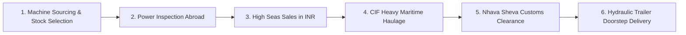

# 03 - UI Component Specifications

> Exact architectural and visual specifications for all interface components, replicating the ThemeForest **Machinery – Factory & Industrial Business** template while addressing the unique business workflows of **Dalal Machine Tools Agency Pvt. Ltd.**

---

## 🏗 Component 1: Industrial Top Utility Bar

### Visual Layout
- **Background**: `--color-secondary` (`#141B22`)
- **Text Color**: `--color-steel-light` (`#9CA3AF`)
- **Accent Elements**: `--color-primary` (`#FFB400`) icons
- **Height**: 44px
- **Layout**: Two-column flex container (`justify-content: space-between; align-items: center`)

```html
<div class="top-bar">
  <div class="container top-bar-container">
    <div class="top-bar-left">
      <span class="top-bar-item">
        <i class="icon-location"></i> C-10, 3rd Floor, Commerce Centre, 78 Tardeo Main Rd, Mumbai 400034
      </span>
      <span class="top-bar-item desktop-only">
        <i class="icon-clock"></i> Mon - Sat: 9:30 AM - 6:30 PM IST
      </span>
    </div>
    <div class="top-bar-right">
      <a href="mailto:dalalmachine@gmail.com" class="top-bar-link">
        <i class="icon-mail"></i> dalalmachine@gmail.com
      </a>
      <a href="tel:+912267439873" class="top-bar-link">
        <i class="icon-phone"></i> +91-22-67439873
      </a>
      <a href="https://wa.me/919821232131" class="top-bar-whatsapp" target="_blank" rel="noopener">
        <i class="icon-whatsapp"></i> +91 9821232131
      </a>
    </div>
  </div>
</div>
```

---

## 🧭 Component 2: Main Industrial Navigation Header

### Features
- **Sticky on Scroll**: Sticks to the top of viewport with a subtle drop shadow (`--shadow-md`).
- **Logo Presentation**: High-contrast brand logo with "DALAL MACHINES - Used & New Metal Working Machinery" subtitle.
- **Mega Menu Dropdown**: 3-column structured dropdown for Used Machinery categorized into Metal Forming, Metal Cutting, and Ready European Stock.
- **Call-to-Action (CTA)**: High-visibility primary button (`REQUEST A QUOTE`) anchored on the right.

```html
<header class="main-header">
  <div class="container header-container">
    <div class="logo-wrapper">
      <a href="/" class="brand-logo">
        
        <div class="brand-text">
          <span class="brand-name">DALAL MACHINES</span>
          <span class="brand-tagline">Machine Tools Agency Pvt. Ltd. • Est. 2004</span>
        </div>
      </a>
    </div>

    <nav class="main-nav">
      <ul class="nav-menu">
        <li class="nav-item active"><a href="/" class="nav-link">Home</a></li>
        <li class="nav-item"><a href="/about-us" class="nav-link">About Us</a></li>
        <li class="nav-item has-dropdown has-megamenu">
          <a href="/used-machines" class="nav-link">Used Machines <i class="icon-chevron-down"></i></a>
          <div class="megamenu-panel">
            <div class="megamenu-col">
              <h4 class="megamenu-title"><i class="icon-anvil"></i> Metal Forming Machinery</h4>
              <ul class="megamenu-list">
                <li><a href="/used-machines/hot-forging-press">Hot Forging Press (500T - 6300T)</a></li>
                <li><a href="/used-machines/knuckle-joint-press">Knuckle Joint Press</a></li>
                <li><a href="/used-machines/mechanical-sheet-metal-press">Mechanical Sheet Metal Press</a></li>
                <li><a href="/used-machines/hydraulic-sheet-metal-press">Hydraulic Sheet Metal Press</a></li>
                <li><a href="/used-machines/trimming-press">Trimming Press</a></li>
                <li><a href="/used-machines/pneumatic-hammer">Pneumatic & Drop Hammers</a></li>
                <li><a href="/used-machines/friction-screw-press">Friction Screw Press</a></li>
                <li><a href="/used-machines/cold-forging-press">Cold Forging Press</a></li>
                <li><a href="/used-machines/upsetter">Forging Roll & Upsetter</a></li>
                <li><a href="/used-machines/open-die-forging-press">Open Die Forging & Manipulators</a></li>
              </ul>
            </div>
            <div class="megamenu-col">
              <h4 class="megamenu-title"><i class="icon-gear"></i> Metal Cutting Machinery</h4>
              <ul class="megamenu-list">
                <li><a href="/used-machines/horizontal-boring-machine">Horizontal Boring Machines (TOS, Skoda)</a></li>
                <li><a href="/used-machines/vertical-machining-centre">Vertical Machining Centre (VMC)</a></li>
                <li><a href="/used-machines/horizontal-machining-centre">Horizontal Machining Centre (HMC)</a></li>
                <li><a href="/used-machines/milling-machine">Heavy Milling Machines</a></li>
                <li><a href="/used-machines/vertical-turning-lathe">Vertical Turning Lathes (VTL)</a></li>
                <li><a href="/used-machines/gear-hobbing-machine">Gear Hobbing & Shaping</a></li>
                <li><a href="/used-machines/cnc-lathes">Heavy Duty CNC Lathes</a></li>
                <li><a href="/used-machines/slotting-machine">Precision Slotting Machines</a></li>
              </ul>
            </div>
            <div class="megamenu-col megamenu-highlight">
              <div class="highlight-card">
                <span class="badge badge-under-power">DIRECT EUROPE STOCK</span>
                <h5>Inspection Under Power</h5>
                <p>Verify live working condition at warehouses across Germany, Italy, and Russia before booking.</p>
                <a href="/services/inspection" class="btn-text">Learn Inspection Process &rarr;</a>
              </div>
            </div>
          </div>
        </li>
        <li class="nav-item"><a href="/brand-new-machinery" class="nav-link">Brand New</a></li>
        <li class="nav-item"><a href="/services" class="nav-link">Services</a></li>
        <li class="nav-item"><a href="/gallery" class="nav-link">Gallery & Videos</a></li>
        <li class="nav-item"><a href="/contact" class="nav-link">Contact</a></li>
      </ul>
    </nav>

    <div class="header-action">
      <a href="#quote-modal" class="btn btn-primary" data-modal="quote-modal">
        <i class="icon-calculator"></i> REQUEST A QUOTE
      </a>
    </div>
  </div>
</header>
```

---

## ⚡ Component 3: Industrial Hero Carousel

### Key Slides
1. **Slide 1 (Heavy Forging Focus)**:
   - **Headline**: "WORLD-CLASS USED FORGING PRESSES UP TO 6,300 TON"
   - **Subhead**: "Direct European & Russian sourcing. Fully tested under power. Imported seamlessly on High Seas Sales in Indian Rupees."
   - **CTAs**: `[ BROWSE FORMING MACHINERY ]` (Primary) & `[ REQUEST POWER INSPECTION ]` (Outline)
2. **Slide 2 (Metal Cutting & Heavy Machine Tools)**:
   - **Headline**: "HEAVY DUTY HORIZONTAL BORING & CNC MACHINING CENTRES"
   - **Subhead**: "Renowned European brands (TOS, Skoda, Dorries, Schiess). Ready for immediate shipping with complete foundation drawings."
   - **CTAs**: `[ VIEW CUTTING MACHINERY ]` (Primary) & `[ TALK TO EXPERT ]` (Outline)
3. **Slide 3 (Hassle-Free Import & High Seas Sales)**:
   - **Headline**: "NO FOREIGN EXCHANGE RISK. 100% BILL OF ENTRY & GST BENEFITS"
   - **Subhead**: "We handle international CIF freight, Nhava Sheva & Mumbai Port clearance, and doorstep heavy transport across India."
   - **CTAs**: `[ HOW HIGH SEAS SALES WORKS ]` (Primary) & `[ CONTACT OFFICE ]` (Outline)

---

## 📦 Component 4: Overlapping 4-Column Feature Highlights

Positioned to overlap the bottom of the Hero slider with negative margin (`margin-top: -60px; z-index: 10`), establishing immediate credibility:

```html
<section class="feature-strip">
  <div class="container">
    <div class="feature-grid">
      <!-- Card 1 -->
      <div class="feature-card">
        <div class="feature-icon"><i class="icon-warehouse"></i></div>
        <div class="feature-info">
          <h4>Europe & Russia Stock</h4>
          <p>Extensive inventory of heavy presses ready in European warehouses.</p>
        </div>
      </div>
      <!-- Card 2 -->
      <div class="feature-card">
        <div class="feature-icon"><i class="icon-gauge-check"></i></div>
        <div class="feature-info">
          <h4>Tested Under Power</h4>
          <p>Inspect machines running under live power abroad prior to purchase.</p>
        </div>
      </div>
      <!-- Card 3 -->
      <div class="feature-card">
        <div class="feature-icon"><i class="icon-rupee"></i></div>
        <div class="feature-info">
          <h4>High Seas Sales (INR)</h4>
          <p>Zero forex risk. Full GST input benefits and Bill of Entry in your name.</p>
        </div>
      </div>
      <!-- Card 4 -->
      <div class="feature-card">
        <div class="feature-icon"><i class="icon-ship-crane"></i></div>
        <div class="feature-info">
          <h4>Port to Doorstep Delivery</h4>
          <p>Handling heavy CIF shipments up to 6,300T with Mumbai port customs clearance.</p>
        </div>
      </div>
    </div>
  </div>
</section>
```

---

## 📊 Component 5: About Section with Big Industrial KPI Counters

A split 2-column section: Left has an industrial photo collage with a gold badge overlay ("20+ YEARS ESTABLISHED"), and Right has the company story, verified promises, and animated metric counters.

```html
<div class="kpi-grid">
  <div class="kpi-item">
    <div class="kpi-number" data-target="20">20+</div>
    <div class="kpi-label">Years of Industry Leadership</div>
  </div>
  <div class="kpi-item">
    <div class="kpi-number" data-target="6300">6,300T</div>
    <div class="kpi-label">Max Press Weight Handled</div>
  </div>
  <div class="kpi-item">
    <div class="kpi-number" data-target="500">500+</div>
    <div class="kpi-label">Heavy Machines Delivered</div>
  </div>
  <div class="kpi-item">
    <div class="kpi-number" data-target="100">100%</div>
    <div class="kpi-label">Documented Transparency</div>
  </div>
</div>
```

---

## 🗃 Component 6: Machine Inventory Cards with Technical Badges

The centerpiece of the Machinery template is a high-density, technical product card designed for engineers and procurement managers.

```html
<div class="machine-card" data-category="forming" data-tonnage="1600">
  <div class="machine-card-media">
    
    <span class="badge badge-under-power"><i class="icon-check"></i> Seen Under Power</span>
    <span class="badge-tonnage-tag">1,600 TON</span>
  </div>
  <div class="machine-card-body">
    <span class="machine-cat-label">Metal Forming • Hot Forging Press</span>
    <h3 class="machine-title">Voronezh K8542 Hot Forging Press</h3>
    <div class="machine-specs-table">
      <div class="spec-row"><span class="spec-name">Make:</span> <span class="spec-val">Voronezh (TMP)</span></div>
      <div class="spec-row"><span class="spec-name">Model:</span> <span class="spec-val">K8542</span></div>
      <div class="spec-row"><span class="spec-name">Nominal Force:</span> <span class="spec-val">16000 kN (1600 Ton)</span></div>
      <div class="spec-row"><span class="spec-name">Ram Stroke:</span> <span class="spec-val">300 mm</span></div>
      <div class="spec-row"><span class="spec-name">Current Location:</span> <span class="spec-val">Europe Warehouse</span></div>
    </div>
    <div class="machine-card-footer">
      <a href="/used-machines/forming/voronezh-k8542-1600" class="btn btn-sm btn-secondary">Full Specs</a>
      <button class="btn btn-sm btn-primary" onclick="openInquiryModal('Voronezh K8542 1600 Ton')">Inquire Now</button>
    </div>
  </div>
</div>
```

---

## 🔄 Component 7: The 6-Step Turnkey Import Process Timeline

Visual horizontal step chain illustrating Dalal Machines' unique value proposition over competitors:



---

## 📝 Component 8: Multi-Step RFQ & Quick Quote Modal

A pop-up modal or embedded section that allows buyers to quickly specify their technical requirements:
- **Field 1**: Category (Metal Forming / Metal Cutting / Brand New)
- **Field 2**: Machine Type (e.g. Hot Forging Press, Horizontal Boring, VMC)
- **Field 3**: Required Capacity / Tonnage / Stroke
- **Field 4**: Company Name & GST Number
- **Field 5**: Contact Person & Phone / WhatsApp
- **Field 6**: Target Delivery Timeline

---

## 🪨 Component 9: Industrial Dark Footer

### Structure: 4 Columns
1. **Company Profile**: Logo, Dalal Machine Tools Agency Pvt. Ltd. summary, 20+ years track record, direct email/phone.
2. **Quick Navigation**: Home, About Us, Services, High Seas Sales Benefits, Gallery, Contact.
3. **Machinery Categories**: Hot Forging Presses, Knuckle Joint Presses, Horizontal Boring, VMC/HMC, Heavy Lathes, Hammers.
4. **Mumbai Headquarters**:
   - `C-10, 3rd Floor, Commerce Centre, 78, Tardeo Main Road, Mumbai - 400034`
   - Phone: `+91-22-67439873` | Mobile: `+91 9821232131`
   - Google Map preview button
   - Direct WhatsApp chat link
