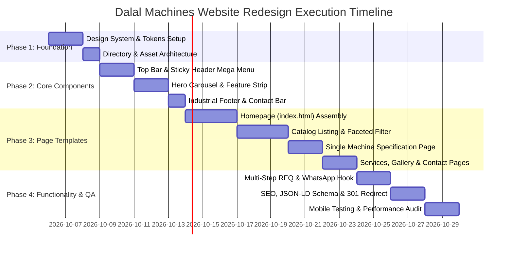

# 06 - Step-by-Step Implementation Plan

> Production execution roadmap to build, validate, and launch the modernized **Dalal Machine Tools Agency Pvt. Ltd.** website with the ThemeForest **Machinery** template UI design.

---

## 📅 Roadmap Overview



---

## 🛠 Phase 1: Foundation & Design System Setup

### Step 1.1: File & Folder Architecture
Establish a clean, modular folder hierarchy:
```
d:/Experiment/
├── assets/
│   ├── css/
│   │   ├── variables.css      /* Color tokens, typography, shadows */
│   │   ├── base.css           /* Reset, typography, layout containers */
│   │   ├── components.css     /* Buttons, badges, cards, forms, modals */
│   │   ├── header-footer.css  /* Topbar, sticky header, megamenu, footer */
│   │   ├── home.css           /* Hero slider, KPI counter, features */
│   │   ├── catalog.css        /* Faceted sidebar, product grid, tags */
│   │   └── machine-detail.css /* Gallery zoom, spec tables, tabs */
│   ├── js/
│   │   ├── main.js            /* Navigation drawer, sticky header, modal */
│   │   ├── slider.js          /* Industrial hero slider / carousel */
│   │   ├── filter.js          /* Faceted catalog search and filter */
│   │   └── rfq.js             /* Multi-step quote form and WhatsApp API */
│   └── images/
│       ├── logo/              /* Vector SVG and high-res PNG logos */
│       ├── hero/              /* High-impact heavy machinery banners */
│       ├── icons/             /* Engineering SVG icons */
│       └── machines/          /* Catalog machine photos and diagrams */
├── index.html                 /* Modern Homepage */
├── used-machines.html         /* Filterable Machine Catalog */
├── machine-detail.html        /* Detailed Single Machine Spec Page */
├── services.html              /* 6 Core Import & Inspection Services */
├── gallery.html               /* Media & Video Demonstrations */
├── contact.html               /* Mumbai Office & Instant RFQ Center */
└── README.md                  /* Documentation Master Index */
```

### Step 1.2: Design Tokens Implementation
Implement all CSS custom properties defined in [`01_DESIGN_SYSTEM.md`](file:///d:/Experiment/01_DESIGN_SYSTEM.md) into `variables.css`.

---

## 🏗 Phase 2: Core Components Construction

### Step 2.1: Header, Mega Menu & Sticky Navigation
- Implement the 44px dark industrial top utility bar (`+91-22-67439873`, Mumbai address, working hours).
- Build the 3-column Mega Menu categorizing **Metal Forming (16 lines)**, **Metal Cutting (10 lines)**, and **Europe Ready Stock**.
- Implement mobile hamburger drawer with slide-in transition for smartphones and tablets.

### Step 2.2: Industrial Hero Carousel & Feature Strip
- Build the auto-advancing hero slider with tactile navigation arrows and progress indicators.
- Create the overlapping 4-pillar feature box (`Europe Stock`, `Under Power Test`, `High Seas INR`, `Port to Doorstep`).

### Step 2.3: Reusable Industrial Button & Badge Library
- Primary Gold Chamfered Buttons (`.btn-primary`).
- Machine Status Badges (`.badge-under-power`, `.badge-tonnage`, `.badge-origin`).

---

## 📄 Phase 3: Page Templates & Assembly

### Step 3.1: Homepage Assembly (`index.html`)
Assemble all sections in exact sequence:
1. Topbar & Header
2. Hero Slider (3 slides showcasing Forging Presses, HBM/VMC, and High Seas Sales)
3. 4 Overlapping Feature Cards
4. About Dalal Machines + 4 Animated KPI Counters (20+ Years, 6300T Max Press, 500+ Delivered)
5. 6 Services Cards (Sourcing, Power Inspection, High Seas, CIF, Mumbai Port Clearance, Haulage)
6. Filterable Featured Machine Catalog (6 high-tonnage machines with technical specs)
7. High Seas Sales Comparison Matrix (Dalal High Seas vs. Direct Import Risk)
8. Inspection Guarantee Seal ("Seen Under Power with GA Drawings")
9. Testimonials & Automotive/Defense Forging Case Studies
10. Industrial Instant RFQ Form
11. 4-Column Industrial Footer

### Step 3.2: Used Machinery Catalog Page (`used-machines.html`)
- Integrate faceted search sidebar with category checkboxes, tonnage range slider, and inspection status filter.
- Build responsive 3-column machine card grid.

### Step 3.3: Single Machine Detail Specification Page (`machine-detail.html`)
- Dual-column layout: High-res zoomable gallery + live video inspection player on left; commercial terms, quick parameters, and inquiry buttons on right.
- Tabbed technical spec table (Forces, strokes, table size, daylight, motor power, total weight).
- High Seas Sales benefit breakdown for this machine.

### Step 3.4: Services, Gallery & Contact Pages
- **Services**: Detailed walkthrough of each step in the international procurement chain.
- **Gallery**: Filterable video library showing live press runs under power abroad.
- **Contact**: Mumbai Head Office address card, interactive Google map, direct phone numbers, and RFQ form.

---

## ⚡ Phase 4: Interactivity, SEO & Launch

### Step 4.1: Instant RFQ & Direct WhatsApp Integration
- Add multi-step quote request modal triggered by any "Request a Quote" or "Inquire Now" button.
- Format inquiry submissions into a pre-filled WhatsApp message:
  ```
  https://wa.me/919821232131?text=Hello%20Dalal%20Machines,%20I%20am%20interested%20in%20[Machine%20Name].%20Please%20share%20quotation%20and%20inspection%20details.
  ```

### Step 4.2: SEO Meta Tags & JSON-LD Structured Data
- Add Google-compliant JSON-LD structured data for `LocalBusiness`, `Organization`, and `Product`:
  ```json
  {
    "@context": "https://schema.org",
    "@type": "LocalBusiness",
    "name": "Dalal Machine Tools Agency Pvt. Ltd.",
    "telephone": "+91-22-67439873",
    "email": "dalalmachine@gmail.com",
    "address": {
      "@type": "PostalAddress",
      "streetAddress": "C-10, 3rd Floor, Commerce Centre, 78, Tardeo Main Road",
      "addressLocality": "Mumbai",
      "postalCode": "400034",
      "addressCountry": "IN"
    }
  }
  ```

### Step 4.3: Legacy URL 301 Redirection
- Setup Apache `.htaccess` or Nginx rewrite rules matching the legacy migration table in [`02_INFORMATION_ARCHITECTURE.md`](file:///d:/Experiment/02_INFORMATION_ARCHITECTURE.md).
